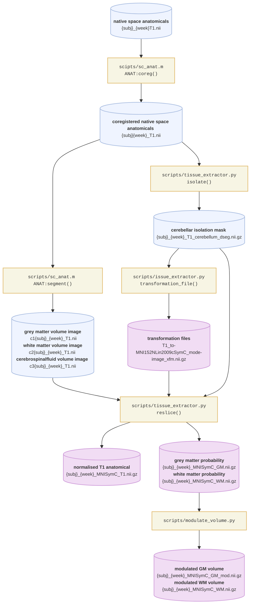
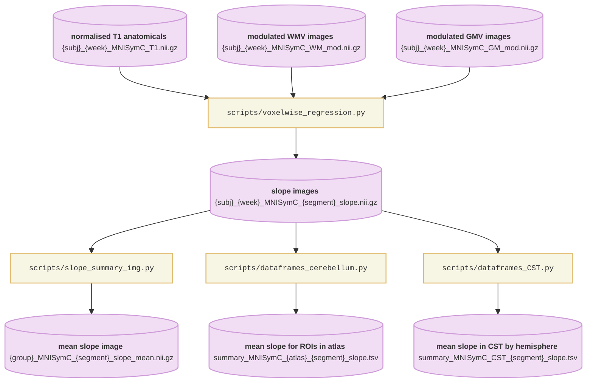
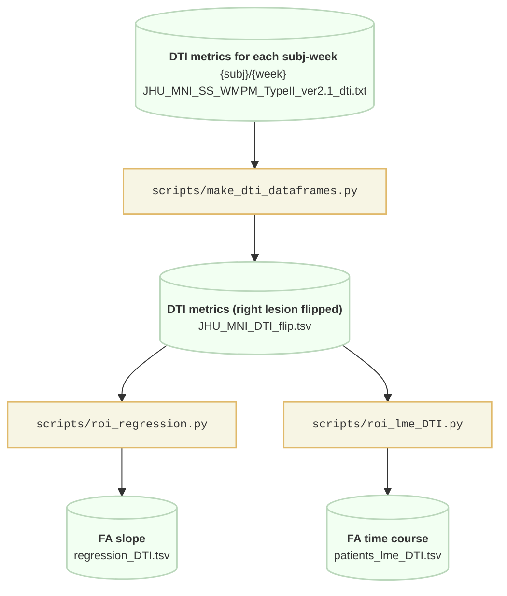

# Structural changes in the cerebellum following cortical stroke

This project investigates structural changes to the cerebellum and brain stem following (sub)cortical stroke in N = 40 patients and N = 12 healthy controls. T1-weighted structural MRIs are taken of individuals over the course of 1 year, from within 2 weeks post-stroke to 52 weeks post-stroke (in patients) - healthy controls are also imaged at the same time points. DTI-MRI was also taken at these time points, obtaining a grey-scale FA map.

## Image processing pipeline for T1w anatomicals

A pipeline for processing anatomicals, using mainly SUITPy and SPM12, has been written.

**Prerequisites**

* [SUITPy](https://github.com/DiedrichsenLab/SUITPy) (Python release of SUIT)
	* Plus pre-requisites required for SUITPy; see [tutorial](https://suitpy.readthedocs.io/en/latest/)
* [SPM12](https://github.com/spm/spm12)
* [spmj_tools](https://github.com/DiedrichsenLab/spmj_tools) (toolbox for SPM)
* [Dataframe](https://github.com/DiedrichsenLab/dataframe) (for reading .tsv as MAT file)

**Processing steps**

**1. Coregistration**

  To take full advantage of longitudinal data, images must be properly aligned with respect to the first available image - the reference image.
  
  First, manually align anatomicals: in FSLeyes, open the reference image and the image to be aligned on top. Manually align the latter to the reference so that anatomical structures are roughly aligned.
  
  Then, inside `sc_anat.m`, run the coregistration as `ANAT:coreg`. 
  
  Using algorithm SPM12; code made available through [spmj_tools](https://github.com/DiedrichsenLab/spmj_tools) by the Diedrichsen Lab.

  **2. Segmentation**

  Extract different segments from the image (e.g. soft tissue, CSF): inside `sc_anat.m`, run coregistration function, `ANAT:segment`. Output will be 5 files with prefix "c1" (grey matter segment), "c2" (white matter segment), "c3" (CSF segment), and "c4", "c5". Each voxel value is the volume of a given tissue in that voxel.

  Again, using algorithm SPM12; code made available through [spmj_tools](https://github.com/DiedrichsenLab/spmj_tools) by the Diedrichsen Lab.

  **3. Tissue extraction**

  (a) Extract cerebellum from T1 anatomicals

  (b) Get transformation files for deforming native spaces cerebelli into a group template (we used MNI Symmetric cerebellum-only template)

  (c) Normalise native space cerebelli (T1, grey matter segment, white matter segment) to the group template of the cerebellum

  The result is an image (T1 or tissue) normalised to a group template.

  All algorithms described above are from [SUITPy](https://github.com/DiedrichsenLab/SUITPy), developed by the Diedrichsen Lab.

  **4. Volume modulation**

  Images of the segments normalised to a template will have voxel values denoting the probability of that segment in a given voxel. Modulated volume images can be used to analyse volume in template space.

  

### Regression analysis of anatomicals

We performed a voxel-wise linear regression to see the average change over a year within individuals, and used a linear mixed effects (LME) model to see the time course. These regressions are performed on the T1-intensity (normalised to MNISymC), and on the segmentations fro WM, GM, and CSF (modulated volumes).

**Voxel-wise linear regression**: average change over time in an individual; run with `voxelwise_regression.py`. Produces two images per subject: an intercept image, and a slope image (showing the average change). Must have images from at least two weeks. These images can then be summarized into a mean or median slope image within each group (patients, controls) using `slope_summary_img.py`. We can also look at the mean slope in a given ROI (e.g. cerebellar ROIs or the CST): use `dataframes_cerebellum.py` for cerebellar ROIs and `dataframes_CST.py` for the CST (or other WM tracts).

**lme**: time course for change; run wtih `roi_lme.py`. Model is fit separately for patients and controls to the mean T1 intensity (normalised T1) or segment volume (modulated WM, GM) for a given ROI.

Analysis of the cerebellar cortex uses the functional parcellations of the cerebellum defined by the Nettekoven atlas [(Nettekoven et al., 2024)](https://doi.org/10.1038/s41467-024-52371-w).

## DTI analysis pipeline

DTI images give grey-scale FA maps in JHU-MNI space; a white matter atlas (WMPM Type II) [(Mori et al., 2008)](https://doi.org/10.1016/j.neuroimage.2007.12.035) gives the following metrics in 189 WM ROIs: FaMap, trace, eigenvalues 1, 2, 3. FA Map means are analyzed using a linear regression for the average slope and an LME for time course.

